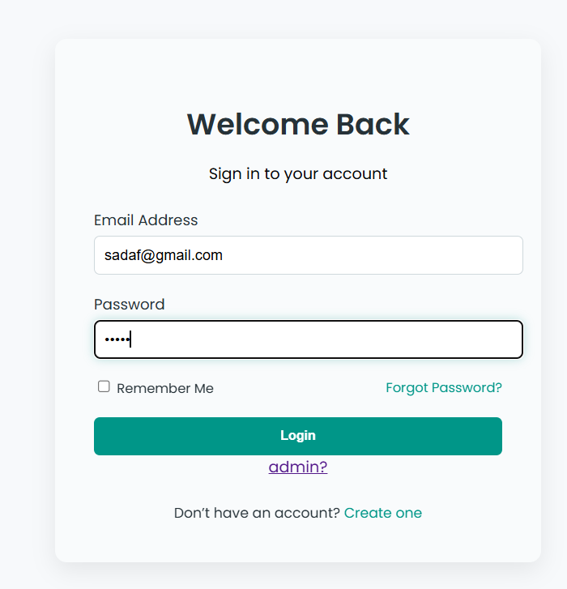
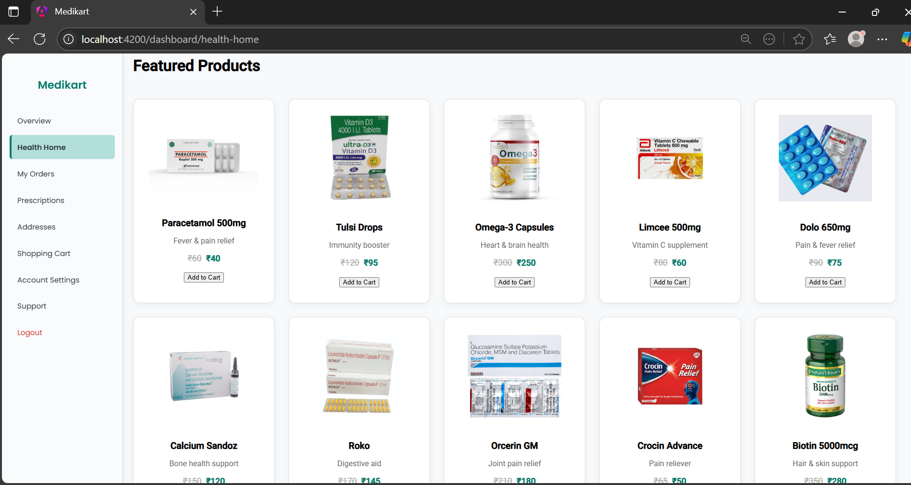
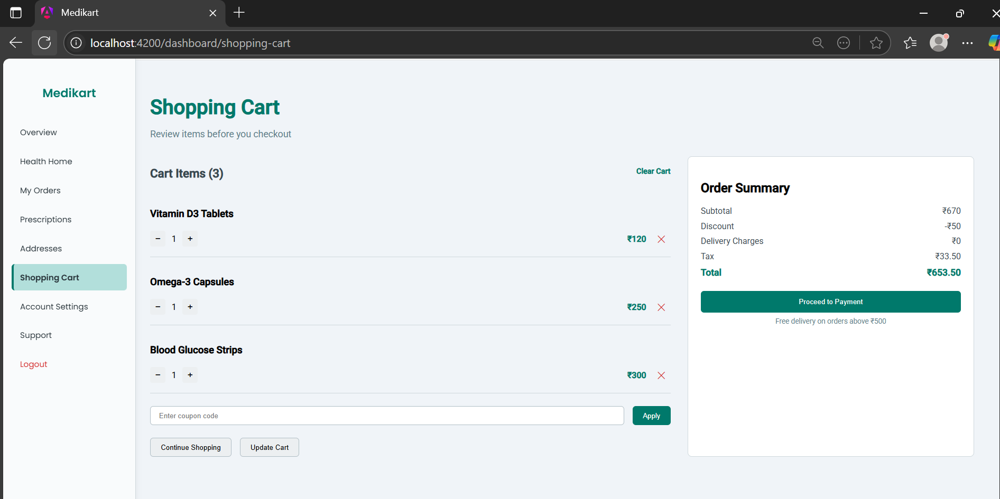
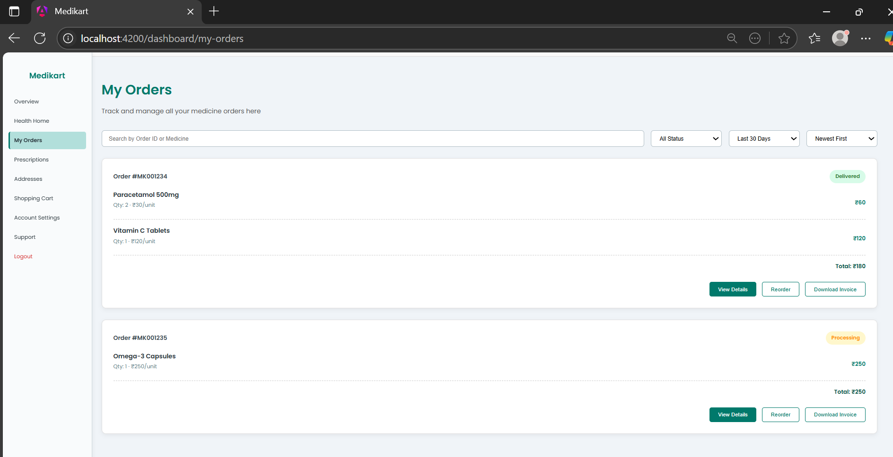
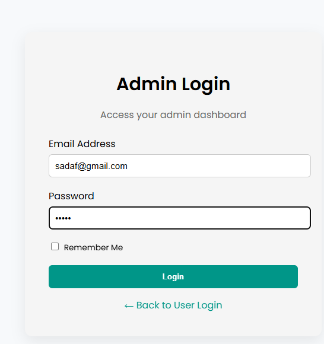
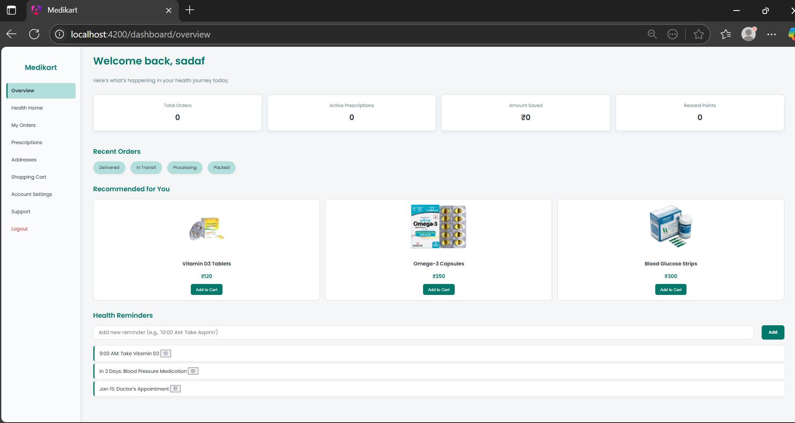

# Medikart – A Comprehensive Digital Healthcare Platform

**Medikart** is a full-stack healthcare e-commerce application engineered to streamline digital access to medical services. It empowers users to purchase medicines, upload prescriptions, manage health profiles, and monitor orders through an intuitive and secure interface.

> **Author:** [Sadaf Kauchali](https://github.com/SadafKauchali)  
> **Tech Stack:** Angular • Spring Boot • MySQL • JWT  
> **Status:** Completed and production-ready

---

## 🔍 Project Overview

Medikart is designed to simplify the healthcare purchasing experience. It integrates both user and admin roles into a unified system with clearly segmented functionalities.

### Key Objectives:
- Facilitate the digital purchase of genuine medical products  
- Enable prescription uploads and order-based consultation  
- Support user profile and order management  
- Offer secure admin-level inventory and order control  
- Implement JWT-based authentication and role-based access

---

## 🖼️ Screenshots

### 🔐 User Login


### 🏥 Home Page


### 🛒 Shopping Cart


### 📦 My Orders


### 🧑‍💼 Admin Login


### 📊 Admin Overview Dashboard


---

## 🧠 Technology Stack

### Frontend – Angular
- Angular 17 with TypeScript  
- RxJS & Reactive Forms  
- Modular SCSS styling  
- Component-based architecture for scalability

### Backend – Spring Boot
- Spring Boot 3.5 with Java 17+  
- RESTful API structure  
- Spring Security with JWT integration  
- Hibernate (JPA) and MySQL for data persistence

---

## ⚙️ Core Functionalities

### For Users:
- Secure registration/login with JWT  
- Browse and filter medical products  
- Add to cart and wishlist  
- Upload prescriptions for review  
- Track orders and download invoices  
- Manage profile and address book  
- Change password securely

### For Admins:
- Dedicated admin login  
- Add/update/delete product inventory  
- View and manage all orders  
- Admin-specific dashboard with return tracking  
- Backend-managed data integrity

---

## 🚀 Getting Started

### Backend Setup (Spring Boot)

Make sure MySQL is installed and a database named `medikart` is created.

```bash
cd backend
mvn clean install
mvn spring-boot:run
```

Runs at: http://localhost:8080

Frontend Setup (Angular)
```
cd frontend
npm install
ng serve
```
Runs at: http://localhost:4200

### 🔐 Authentication & Security
JWT-based stateless authentication

Role-based access control (User/Admin)

Tokens securely stored in localStorage

Backend validates all protected routes

### 🛠️ Future Enhancements
Payment gateway integration (Stripe/Razorpay)

Email/SMS notifications

PWA support

Auto-reminder for refills

Internationalization (i18n)

### 📜 License
This project is licensed under the MIT License.
Feel free to use, adapt, or contribute — attribution is appreciated.
